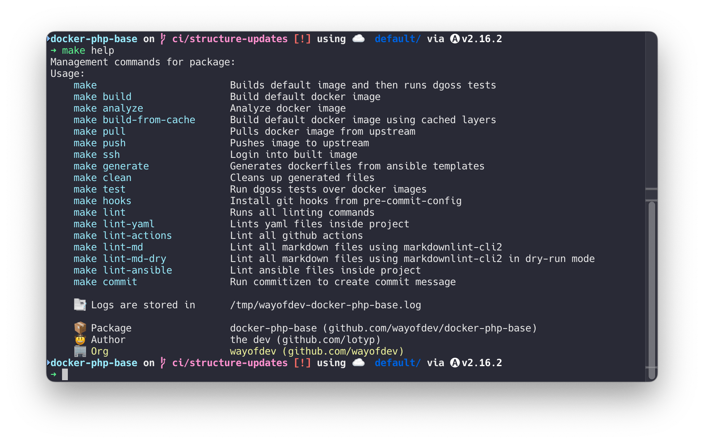

# Contributing

Welcome to the docker-php-dev project!

We appreciate your interest in contributing. This guide will help you get started, ensuring an effective collaboration.

## 🗂 Table of Contents

* [Introduction](#-introduction)
* [Development Requirements](#-development-requirements)
* [Quick Project Setup](#-quick-project-setup)
* [Using the Makefile](#-using-the-makefile)
* [Workflow](#-workflow)
* [Docker Support](#-docker-support)
* [Continuous Integration with GitHub Actions](#-continuous-integration-with-github-actions)
* [Before You Contribute](#-before-you-contribute)
* [Commit Message Guidelines](#-commit-message-guidelines)
* [Coding Standards](#-coding-standards)
* [Tests](#-tests)
* [Pre-commit Hooks](#-pre-commit-hooks)

<br>

## 👋 Introduction

If you would like to contribute, please **open an issue** or a pull request. We are always looking for ways to improve the project and would love to hear your ideas.

The latest changes are always in the **`master`** branch, so please make your Pull Request against that branch.

<br>

## 🚩 Development Requirements

Before you begin, you will need to set up your local development environment. Here is what you'll need:

* **Operating System**: macOS Monterey+, Linux, or Windows with WSL2.
* **Docker**: Version 26.0.0 or newer.
* **Ansible**: For generating Dockerfiles and configurations.
* **goss and dgoss**: For testing Docker images.

Optional tools:

* **Pre-commit**: For running git pre-commit hooks.
* **Cz-git**: For formatting git commits.

<br>

## 🚀 Quick Project Setup

Clone the repository:

```bash
git clone git@github.com:wayofdev/docker-php-dev.git && \
cd docker-php-dev
```

<br>

## 🔧 Using the Makefile

This project uses a Makefile to streamline common development tasks. To see available commands, run:

```bash
make help
```



Key commands include:

* `make generate`: Generates Dockerfiles from Ansible templates.
* `make build`: Builds the Docker image.
* `make test`: Runs tests on the Docker image.
* `make lint`: Executes all linting procedures.
* `make lint-yaml`: Lints YAML files.
* `make lint-docker`: Lints Dockerfiles.
* `make lint-ansible`: Lints Ansible files.
* `make analyze`: Analyzes the Docker image using dive.
* `make commit`: Runs cz-git, a commitizen adapter for commit message formatting in a native environment.

<br>

## 💻 Workflow

> [!IMPORTANT]
>
> Please feature/fix/update... into individual PRs (not one changing everything)

* **Fork the Repository**: Start by forking the repository to your GitHub account.
* **Create a Branch**: In your fork, create a new branch for your work. Name it appropriately based on the feature, fix, or update you're working on.
* **Make Your Changes**: Implement your changes
* **Run Tests**: Ensure all tests pass by running `make test`.
* **Update Documentation**: If you've made changes that affect the project's documentation, ensure it is updated.
* **Run Linters**: Ensure your code passes all linting checks using `make lint`.
* **Commit Your Changes**: Use the [Conventional Commits](#-commit-message-guidelines) standard for your commit messages. You can use `make commit` to assist in creating commit messages.
* **Push Your Changes**: Push your branch to your fork on GitHub.
* **Open a Pull Request**: Submit a pull request to the `master` branch of the original repository. Ensure your PR is focused, addressing a single feature, fix, or improvement.

<br>

## 🐳 Docker Support

This project heavily relies on Docker. To build and test images:

```bash
make build
make test
```

<br>

## 🔨 Continuous Integration with GitHub Actions

Our project employs [GitHub Actions](https://github.com/features/actions) for continuous integration, ensuring code quality and reliability. We encourage contributors to review our workflow configurations to understand the CI processes:

| Workflow                                                     | Description                                                         |
|--------------------------------------------------------------|---------------------------------------------------------------------|
| [`apply-labels.yml`](workflows/apply-labels.yml)             | Auto labels PRs based on rules.                                     |
| [`auto-merge-release.yml`](workflows/auto-merge-release.yml) | Automatically merges release PRs.                                   |
| [`build.yml`](workflows/build.yml)                           | Builds Docker images.                                               |
| [`coding-standards.yml`](workflows/coding-standards.yml)     | Checks `yaml`, `md`, `composer`, `php` and commit coding standards. |
| [`create-release.yml`](workflows/create-release.yml)         | Creates a release on GitHub.                                        |
| [`merge.yml`](workflows/merge.yml)                           | Automatically merges PRs.                                           |
| [`shellcheck.yml`](workflows/shellcheck.yml)                 | Checks shell scripts.                                               |
| [`test.yml`](workflows/test.yml)                             | Runs tests on Docker images.                                        |
| [`upload-assets.yml`](workflows/upload-assets.yml)           | Uploads dist assets to GitHub releases.                             |

<br>

## 📝 Before You Contribute

* **Tests**: Include tests that cover any new features or bug fixes.
* **Code Quality**: Utilize `make lint` for code style checks.
* **Documentation**: Update relevant documentation to reflect your changes, ensuring other developers can understand and use your contributions effectively.
* **Commits**: use Conventional Commits standard to create a commit

<br>

## 📩 Commit Message Guidelines

We follow the [Conventional Commits](https://www.conventionalcommits.org/en/v1.0.0/) standard. Please structure your commit messages as follows, using the appropriate prefix:

**Examples:**

```bash
git commit -am 'feat: some feature was introduced'
git commit -am 'fix: something has been fixed'
```

**Allowed Prefixes:**

| Prefix      | Purpose                                                       |
|-------------|---------------------------------------------------------------|
| `feat:`     | Introduces a new feature                                      |
| `fix:`      | Fixes a bug                                                   |
| `perf:`     | Improves performance                                          |
| `docs:`     | Documentation only changes                                    |
| `style:`    | Code style changes (formatting, missing semi-colons, etc.)    |
| `deps:`     | Updates dependencies                                          |
| `refactor:` | Code changes that neither fixes a bug nor adds a feature      |
| `ci:`       | Changes to our CI configuration files and scripts             |
| `test:`     | Adding missing tests or correcting existing tests             |
| `revert:`   | Reverts a previous commit                                     |
| `build:`    | Changes that affect the build system or external dependencies |
| `chore:`    | Other changes that don't modify src or test files             |
| `security:` | A code change that fixes a security issue                     |

<br>

## 🔍 Coding Standards

We use various tools to maintain code quality:

* YAML Lint for YAML files
* Hadolint for Dockerfiles
* Ansible Lint for Ansible files

Run `make lint-yaml`, `make lint-docker`, and `make lint-ansible` to check your code.

Here's a list of tools we use:

### → Yaml Lint

We use [`yamllint`](https://github.com/adrienverge/yamllint) to enforce coding standards in YAML files.

To lint yaml files run:

```bash
make lint-yaml
```

by default, [`cytopia/yamllint`](https://github.com/cytopia/docker-yamllint) Docker image will be used to run linter.

### → Action Lint

We use [`actionlint`](https://github.com/rhysd/actionlint) to enforce coding standards in GitHub Actions workflows.

To lint GitHub Actions run:

```bash
make lint-actions
```

by default, [`rhysd/actionlint`](https://hub.docker.com/r/rhysd/actionlint/tags) Docker image will be used to run linter.

### → Markdown Lint

We use [`markdownlint-cli2`](https://github.com/davidanson/markdownlint-cli2) to enforce coding standards in Markdown files.

To lint markdown files run:

```bash
make lint-md-dry
make lint-md
```

### → Ansible Lint

We use [`ansible-lint`](https://github.com/ansible/ansible-lint) to check Ansible playbooks for practices and behavior that could potentially be improved.

To lint Ansible files, run:

```bash
make lint-ansible
```

<br>

## 🧪 Tests

We use [goss](https://github.com/goss-org/goss) and [dgoss](https://github.com/aelsabbahy/goss/tree/master/extras/dgoss) for testing our Docker images. These tools allow us to validate the state and behavior of our containers.

### → Running Tests

To run tests on the Docker images, use the following command:

```bash
make test
```

This command will build the default image (specified by the `IMAGE_TEMPLATE` variable in the Makefile) and run the goss tests against it.

### → Testing Specific Images

To test a specific image variant, you can specify the `IMAGE_TEMPLATE` variable:

```bash
make test IMAGE_TEMPLATE="8.3-fpm-alpine"
```

Replace `8.3-fpm-alpine` with the desired PHP version, type, and OS.

### → Testing All Images

To test all supported image variants, run:

```bash
make test IMAGE_TEMPLATE="8.1-cli-alpine"
make test IMAGE_TEMPLATE="8.1-fpm-alpine"
make test IMAGE_TEMPLATE="8.1-supervisord-alpine"
make test IMAGE_TEMPLATE="8.2-cli-alpine"
make test IMAGE_TEMPLATE="8.2-fpm-alpine"
make test IMAGE_TEMPLATE="8.2-supervisord-alpine"
make test IMAGE_TEMPLATE="8.3-cli-alpine"
make test IMAGE_TEMPLATE="8.3-fpm-alpine"
make test IMAGE_TEMPLATE="8.3-supervisord-alpine"
```

### → Test Configuration

The goss test configurations are generated from a Jinja2 template located at `src/Dockerfiles/base/goss.yaml.j2`. This template is used by Ansible to generate specific test configurations for each PHP version, type, and OS combination.

### → Writing and Updating Tests

When contributing new features or making changes, please update the `src/Dockerfiles/base/goss.yaml.j2` file. This Jinja2 template defines the tests that will be generated for all image variants. When editing this file:

1. Use Jinja2 syntax for dynamic content that should change based on PHP version, type, or OS.
2. Ensure your tests cover:
    * Presence and correctness of installed PHP extensions
    * Proper configuration of PHP and its extensions
    * Correct functioning of the PHP environment (CLI, FPM, or Supervisord)
    * Any additional features or configurations specific to your changes

After updating the template, regenerate the Dockerfiles and test configurations:

```bash
make generate
```

This command will use Ansible to process the updated template and generate new test configurations for all image variants.

### → Continuous Integration

Our GitHub Actions workflow (`test.yml`) automatically runs these tests for each pull request and push to the main branch. Ensure that all tests pass in your local environment before submitting a pull request.

Remember, thorough testing is crucial for maintaining the reliability and consistency of our Docker images across different PHP versions and configurations. By updating the central Jinja2 template, we ensure consistency across all our image variants.

<br>

## 📦 Pre-commit Hooks

Pre-commit hooks are an optional but highly recommended way to automate the linting and quality checks before committing changes to the repository. This project provides a predefined configuration that helps in maintaining code quality and consistency.

### → Configured Hooks

Our pre-commit configuration includes several hooks:

* **Trailing Whitespace**: Removes unnecessary trailing spaces.
* **End-of-File Fixer**: Ensures that files end with a newline.
* **Fix Encoding Pragma**: Adds or removes the coding pragma line at the top of Python files.
* **Check Added Large Files**: Prevents accidentally adding large files to the git repository, with a current limit set to 600 KB.
* **YAML Lint**: Checks YAML files for syntax errors and enforces coding standards using a custom configuration.
* **Commitizen**: Ensures commit messages meet the conventional commit format. This hook is triggered at the commit message stage.
* **Action Validator**: Validates GitHub Actions workflow files.
* **Ansible Lint**: Checks Ansible playbooks for practices and behavior that could potentially be improved.
* **Ansible Role Checks**: Several hooks to find issues in Ansible roles:
  * Find unused variables
  * Find empty files
  * Find empty directories
  * Fix readability issues
  * Find undefined handlers
  * Find unquoted values

These hooks help maintain code quality, consistency, and prevent common issues before they are committed to the repository.

### → Installing Pre-commit Hooks

To utilize these hooks, you first need to install them using the command provided by the Makefile:

```bash
make hooks
```

<br>
